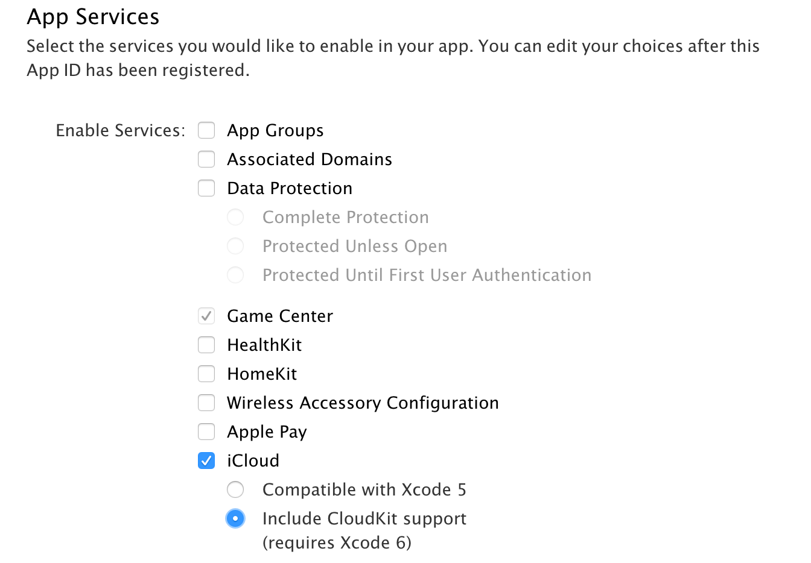
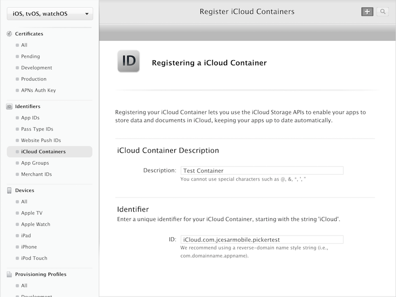

FilePicker Phonegap iOS Plugin
================================

This plugin makes possible to pick files from iCloud or other document providers using a native Document Picker

The file is copied to a temp folder, if you want to keep it, copy the file to a persistent location

It's only available for iOS 8 and later

Prerequisites:
==============
To use the plugin you have to enable iCloud for your App ID, create an iCloud Container on the developer page (https://developer.apple.com/account/ios/identifier/cloudContainer), and then configure your App ID to use that iCloud Container

Step 1: Enable iCloud


Step 2: Create the iCloud Container


Step 3: Configure the App ID to use the iCloud Container clicking "Edit" button


Now you have to recreate your provisioning profile with iCloud enabled.


You can also open the Xcode project on platforms/iOs folder clicking the .xcodeproj file and then go to the project capabilities and enable iCloud there, it should do all 3 steps for you automatically.


Installation:
============

cordova plugin add https://github.com/jcesarmobile/FilePicker-Phonegap-iOS-Plugin.git


Usage:
======

Check if picker is available
============================
Only iOS 8 and higher support picking files from document providers, you can check beforehand whether or not you can use this plugin to have the user select files.

Note that the global FilePicker object is not available before 'deviceready' has fired.

```
FilePicker.isAvailable(function (avail) {
  alert(avail ? "YES" : "NO");
});
```

Pick a file
===========

If you don't pass any params, public.data UTI will be used

```
FilePicker.pickFile(successCallback,errorCallback);
var successCallback = function(path) {
  alert("You picked this file: " + path);
}
```

You can pass the UTI as string
```
FilePicker.pickFile(successCallback,errorCallback,"public.data");
```

If you want to pass more than one UTI you can pass an array of strings
```
var utis = ["public.data", "public.audio"];
FilePicker.pickFile(successCallback,errorCallback,utis);
```

Set the position of the rectangle where the file picker should show up.
```
var utis = ["public.data", "public.audio"];
var position = {};
position.x = 100;
position.y = 100;
position.width = 10;
position.height = 10;
FilePicker.pickFile(successCallback,errorCallback,utis,position);
```

successCallback will bring the file url as string
errorCallback will bring an error message as string


See all the available UTIs https://developer.apple.com/library/ios/documentation/Miscellaneous/Reference/UTIRef/Articles/System-DeclaredUniformTypeIdentifiers.html

Known issues
============
This plugin uses a hook to create a .entitlements file, needed to use the Document Picker, so the plugin won't work on some online builders that don't allow hook execution (like phonegap build)

For more information about the Document Picker: https://developer.apple.com/library/ios/documentation/FileManagement/Conceptual/DocumentPickerProgrammingGuide/Introduction/Introduction.html